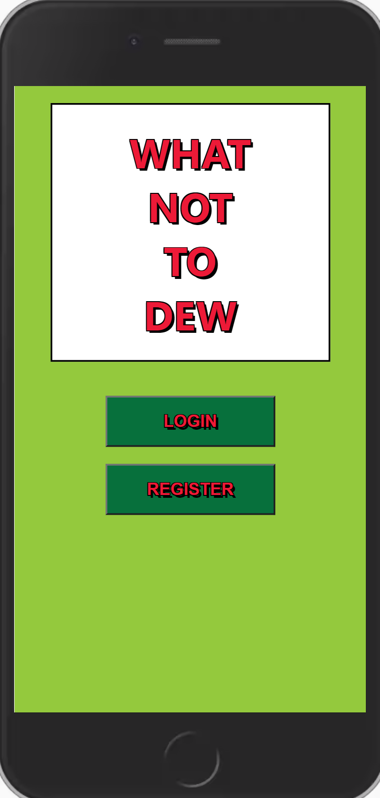
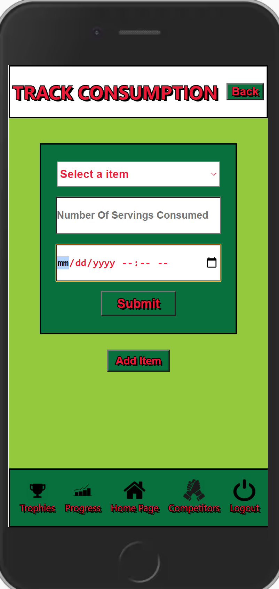

# Welcome to WHAT NOT TO DEW!

> an unhealthy food tracking app

## The Idea

My boyfriend and I have the hardest time cutting back on unhealthy food and drinks that we love. I wanted to create an application that we were able to track how much of any specific food or drink item we were consuming, as well as having the ability to see how much money we are spending and the amount of sugar and calorie intake we were consuming with each of our items. 

## Features

This app allows an individual to track their progress with any individual drink or food item. <br />
Features include:
* Any user can keep track of any food or drink item of their choosing by entering in basic data once to get started.
* User can keep track of how often they are consuming their food/drink of choice by entering in how  much they consumed and at what time.
* A progress page that allows the user to see how much money they have spent and their calorie and sugar intake.
  *The User can choose between the different items they are watching and their progress over a day/week/month/overall.
* Details page will show the user basic nutritional values of that item as wellas how much the average cost of that item is.

## PICs
|  |  |  
| :---: | :---: | :---: |
| Home Page | Path So Far | Create New Item |

|  |  |  
| :---: | :---: | :---: |
| Item Details | Track Consumptions | See Overall Progress |


## Setup
1. Clone this repository
2. ```cd``` into the directory
3. Install the necessary packages:
* ```npm install```
* ```npm i --save react react-dom react-router-dom reactstrap```
* ```npm i --save bootstrap```
* ```npm install json-server```
4. ```mkdir api``` and ```touch database.json``` to create the database
5. Copy and paste sample api below into the database
6. Run ```json-server -w database.json -p 8088``` from the api directory
7. In a separate terminal, run ```npm start``` from the repository directory
8. This app was designed for phone screens so in your browser window press cmd + opt + j (Macs) or ctrl + shift + j (Windows) to open Dev Tools and click Toggle Device Toolbar (pictured below) to change browswer view


## Sample API

You can copy + paste sample data to get an idea of how it can be used or the empty data to try it out from scratch!

### Empty Data
```
{
  "users": [],
  "items": [],
  "consumptions": [],
  "trophies": [
    {
      "id": 1,
      "name": "Less than 3 servings in a day"
    },
    {
      "id": 2,
      "name": "Spent less than $20 in a week"
    },
    {
      "id": 3,
      "name": "5 hours since last consumption"
    },
    {
      "id": 4,
      "name": "Consumed less than 50g of sugar in a day"
    }
  ],
  "userTrophies": []
}
```

### Sample Data
<details><summary>Click for Sample Data</summary>
<p>

```
{
  "users": [
    {
      "email": "mike@mike.com",
      "password": "mike",
      "username": "mike",
      "id": 1
    }
  ],
  "items": [
    {
      "id": 1,
      "name": "Mtn Dew",
      "size": 16,
      "servings": 1,
      "calories": 260,
      "sugar": 37,
      "cost": 2
    }
  ],
  "consumptions": [
    {
      "itemId": 1,
      "servings": 1,
      "time": "2020-09-10T13:40",
      "userId": 1,
      "id": 1
    },
    {
      "itemId": 1,
      "servings": 1,
      "time": "2020-09-25T09:34",
      "userId": 1,
      "id": 2
    },
    {
      "itemId": 1,
      "servings": 2,
      "time": "2020-10-05T09:45",
      "userId": 1,
      "id": 3
    },
    {
      "itemId": 1,
      "servings": 1,
      "time": "2020-10-06T12:34",
      "userId": 1,
      "id": 4
    }
  ],
  "trophies": [
    {
      "id": 1,
      "name": "Less than 3 servings in a day"
    },
    {
      "id": 2,
      "name": "Spent less than $20 in a week"
    },
    {
      "id": 3,
      "name": "5 hours since last consumption"
    },
    {
      "id": 4,
      "name": "Consumed less than 50g of sugar in a day"
    }
  ],
  "userTrophies": [
    {
      "id": 1,
      "userId": 1,
      "trophyId": 2
    }
  ]
}
```

</p>
</details>

## Author

Mikayla Swinkels - [GitHub](https://github.com/mswinkels09), [LinkedIn](www.linkedin.com/in/mikayla-swinkels)
